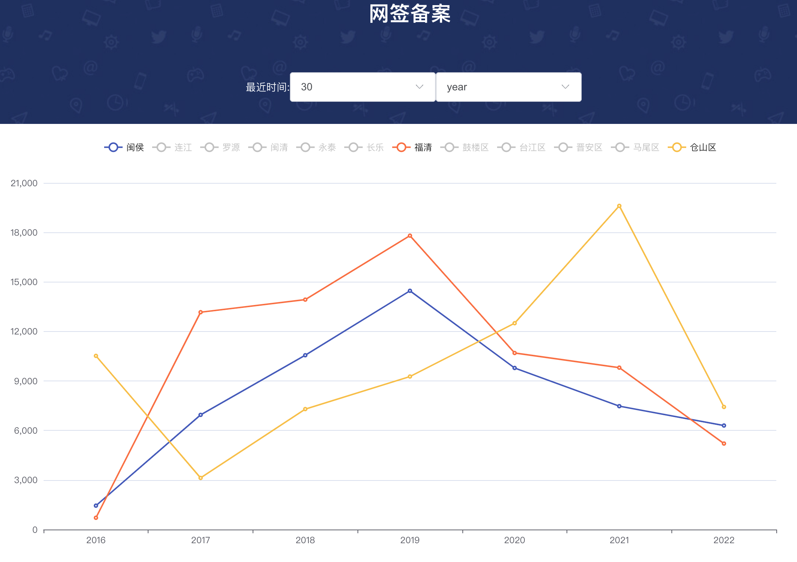

## 关于本项目

go-zero+vue3.0开发的网签备案,前后端分离
****
## 项目脑图

## 效果图

## 项目依赖

1 后端
- go 1.15
- go-zero v1.4.0
- jwt-go （暂未使用）
- carbon
- gorm
- gin (抓数据，暂未开放源码)

2 前端
- typescript
- vue 3.0
- element-plus
- echarts
- axios
- vue-router
- pinia（暂未使用）